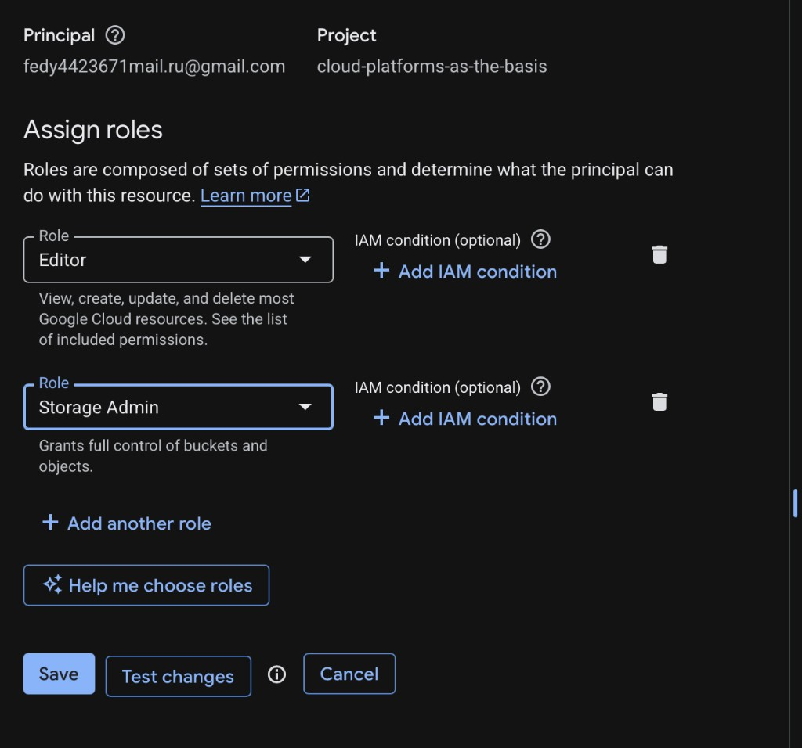
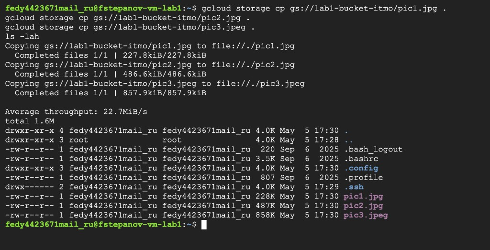
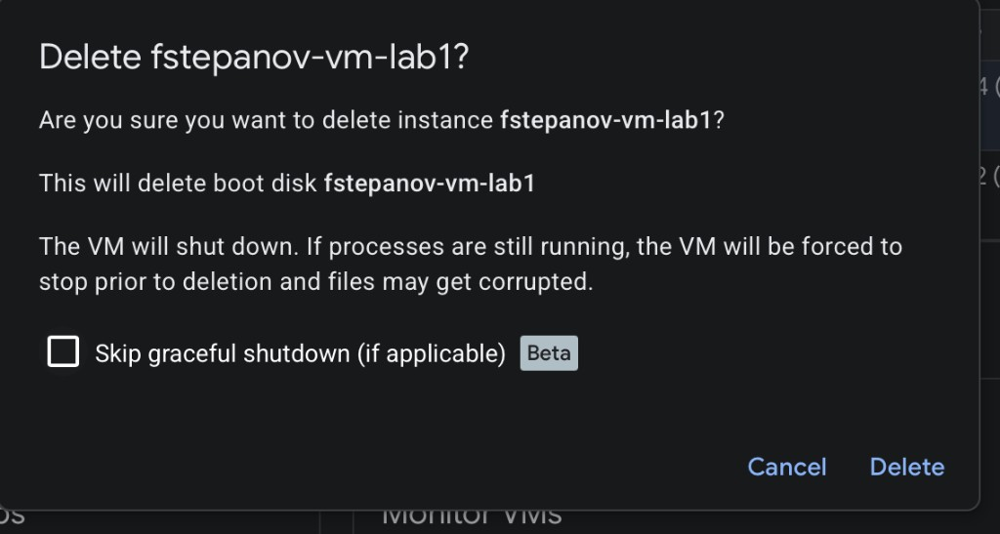

University: [ITMO University](https://itmo.ru/ru/)  
Faculty: [FICT](https://fict.itmo.ru)  
Course: [Cloud platforms as the basis of technology entrepreneurship](https://itmo-ict-faculty.github.io/cloud-platforms-as-the-basis-of-technology-entrepreneurship/)  
Year: 2025/2026  
Group: K66666  
Author: Stepanov Fedor  
Lab: Lab1  
Date of create: 05.05.2026  
Date of finished: 05.05.2026

# Лабораторная работа №1
## Обзор Google Cloud и исследование основных сервисов

## Цель работы
Ознакомиться с основными возможностями Google Cloud: IAM, service account, Compute Engine и Cloud Storage через CLI.

## Ход работы
1. Получен доступ к Google Cloud проекту и открыт раздел IAM.
2. Для аккаунта были назначены роли, в том числе `Storage Admin` для выполнения операций с Cloud Storage.
3. Создана виртуальная машина `fstepanov-vm-lab1` (минимальная конфигурация, spot/e2-micro).
4. Через SSH и `gcloud storage cp` скопированы 3 файла из `gs://lab1-bucket-itmo` в локальную директорию VM.
5. Командой `ls -lah` подтверждено наличие загруженных файлов.
6. После смены прав доступа с `Storage Admin` на менее привилегированные (`Compute Viewer`) операции с бакетом должны завершаться ошибками доступа (ожидаемое поведение IAM).
7. В завершение созданные ресурсы удалены (VM удалена).

## Скриншоты
### Настройка ролей и проверка окружения

### Создание и работа с VM

### Удаление созданных ресурсов

## Выводы
- Роль `Storage Admin` действительно необходима для операций чтения/копирования объектов из бакета.
- Принцип наименьших привилегий в IAM напрямую влияет на успешность команд в CLI.
- Связка `Compute Engine + gcloud CLI` удобна для админских и учебных задач в облаке.
