University: [ITMO University](https://itmo.ru/ru/)  
Faculty: [FICT](https://fict.itmo.ru)  
Course: [Cloud platforms as the basis of technology entrepreneurship](https://itmo-ict-faculty.github.io/cloud-platforms-as-the-basis-of-technology-entrepreneurship/)  
Year: 2025/2026  
Group: K66666  
Author: Stepanov Fedor  
Lab: Lab2  
Date of create: 05.05.2026  
Date of finished: 05.05.2026

# Лабораторная работа №2
## Исследование Cloud Run

## Цель работы
Изучить запуск контейнерного сервиса в Cloud Run, анализ логов/метрик и поведение при изменении порта/ревизий.

## Ход работы
1. Создан сервис Cloud Run `fstepanov-cr-lab2` на базе дефолтного контейнера `hello`.
2. Проверена успешная публикация ревизии и доступность endpoint.
3. В разделе Logs изучены события запуска контейнера и readiness/startup probe.
4. В разделе Metrics проанализированы базовые метрики: concurrency, startup latency, CPU, network, instance count.
5. Выполнено редактирование ревизии с изменением порта контейнера на `8090`, создана новая ревизия.
6. Сравнены логи и состояние сервиса после rollout между ревизиями.
7. В конце лабораторной сервис удален.

## Скриншоты
### Создание сервиса и ревизии
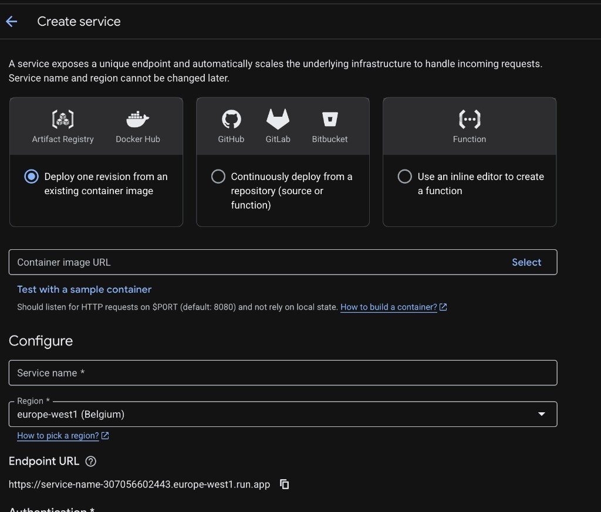
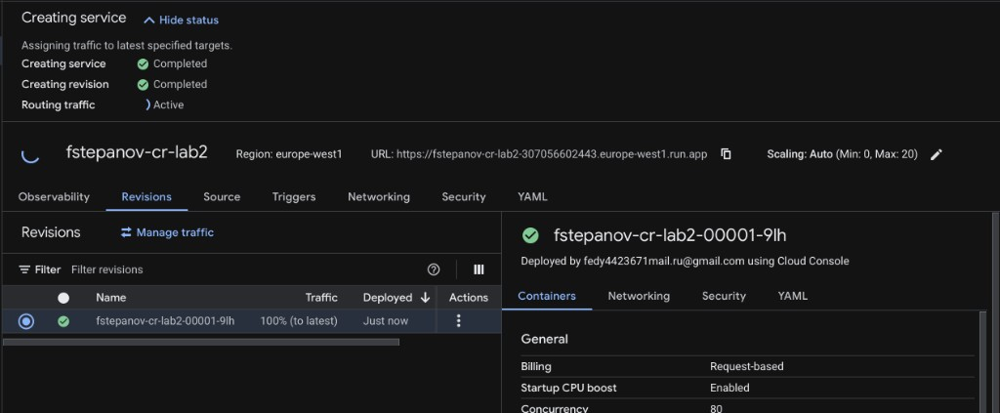

### Логи Cloud Run
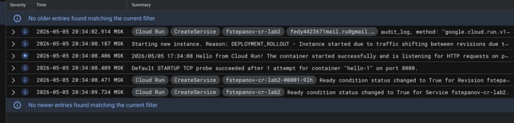
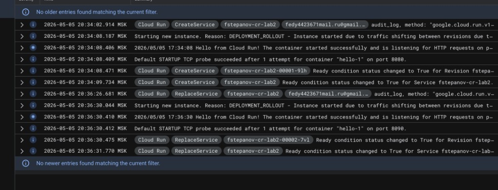

### Изменение порта в ревизии
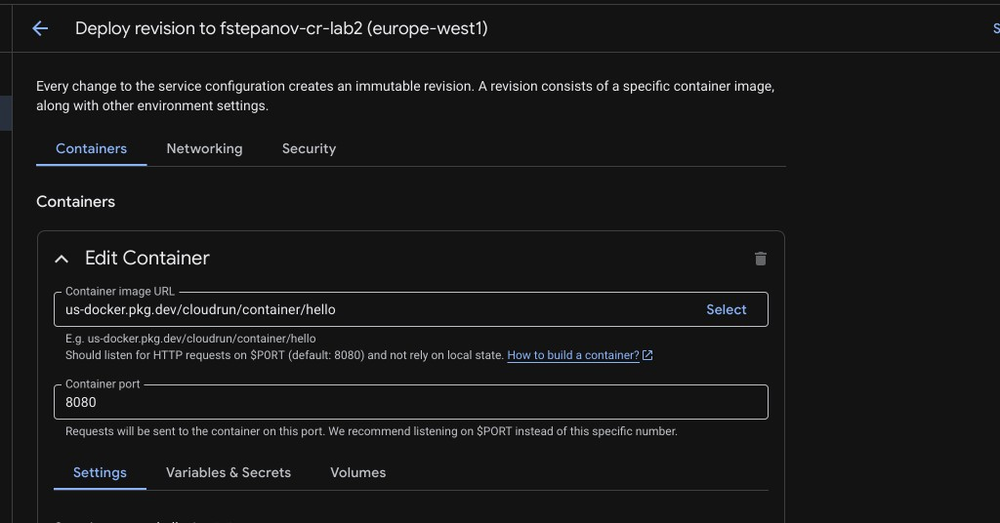
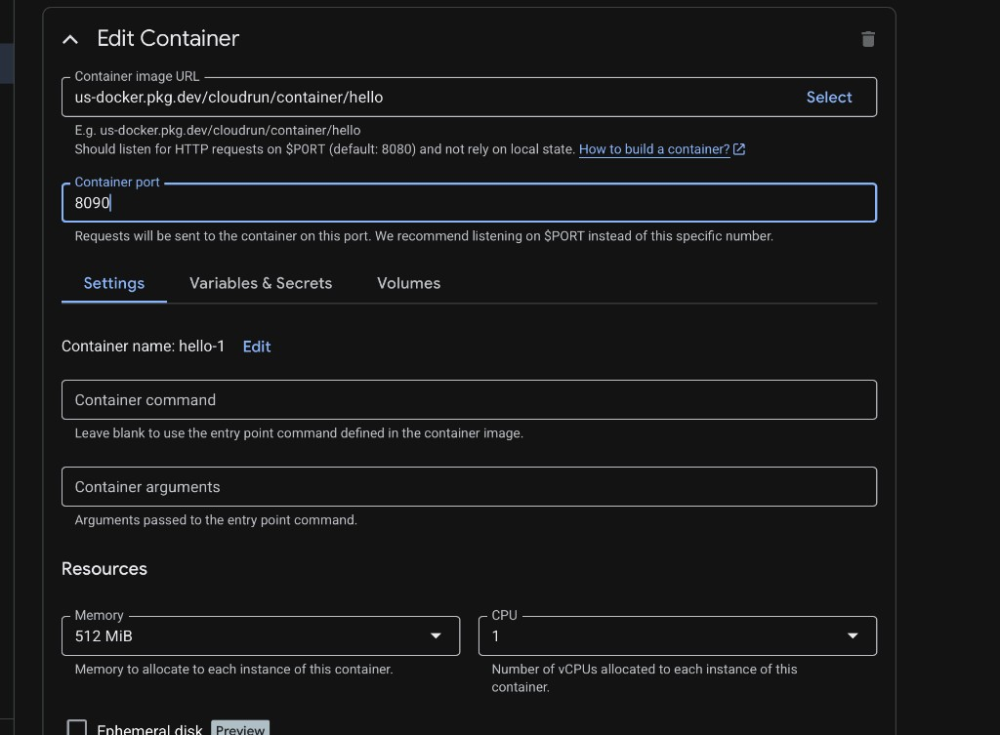

### Метрики
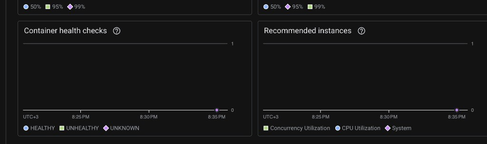
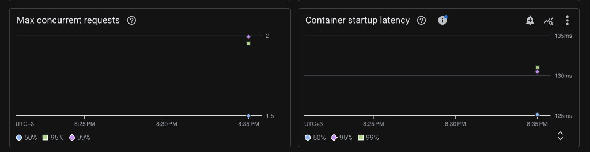
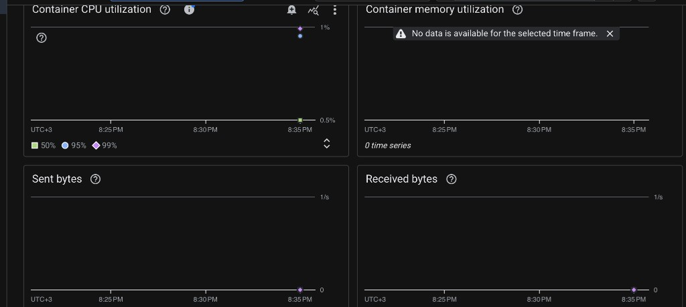
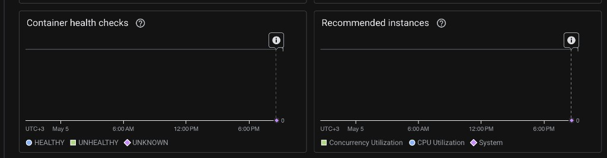
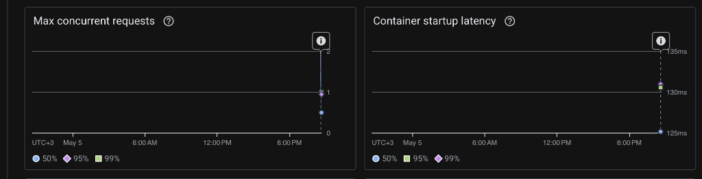
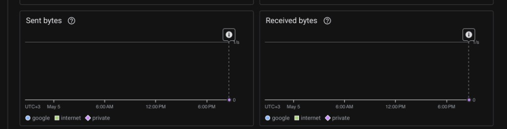
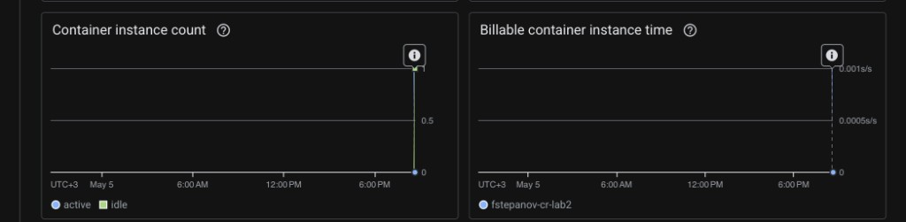

### Очистка ресурсов

## Выводы
- Cloud Run автоматически разворачивает ревизии и управляет трафиком между ними.
- Смена порта влияет на запуск контейнера и должна соответствовать настройкам приложения.
- Логи и метрики дают достаточную картину для первичной диагностики и оценки стабильности сервиса.
