University: [ITMO University](https://itmo.ru/ru/)  
Faculty: [FICT](https://fict.itmo.ru)  
Course: [Cloud platforms as the basis of technology entrepreneurship](https://itmo-ict-faculty.github.io/cloud-platforms-as-the-basis-of-technology-entrepreneurship/)  
Year: 2025/2026  
Group: K66666  
Author: Stepanov Fedor  
Lab: Lab3  
Date of create: 05.05.2026  
Date of finished: 05.05.2026

# Лабораторная работа №3
## Исследование Cloud Storage

## Цель работы
Изучить создание и настройку бакета, работу с объектами, перемещение файлов в «папку», публикацию и удаление ресурсов.

## Ход работы
1. Создан бакет `fstepanov-lab3-bucket` в Cloud Storage.
2. В бакет загружены изображения `111.jpg`, `222.jpg`, `333.jpg`.
3. Создана папка (префикс) `lsllslslsl/` и файлы перемещены внутрь нее.
4. Для бакета снято ограничение public access prevention и добавлен доступ `allUsers`.
5. Через контекстное меню получены публичные URL файлов.
6. После проверки доступности и структуры хранения бакет удален.

## Скриншоты
### Создание и начальное состояние бакета
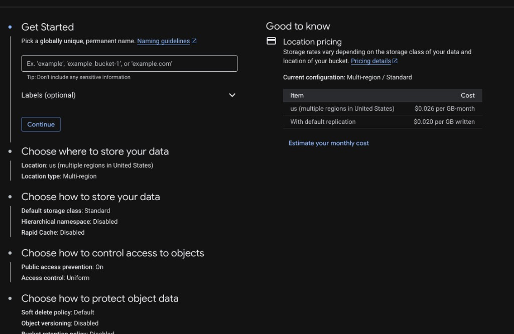
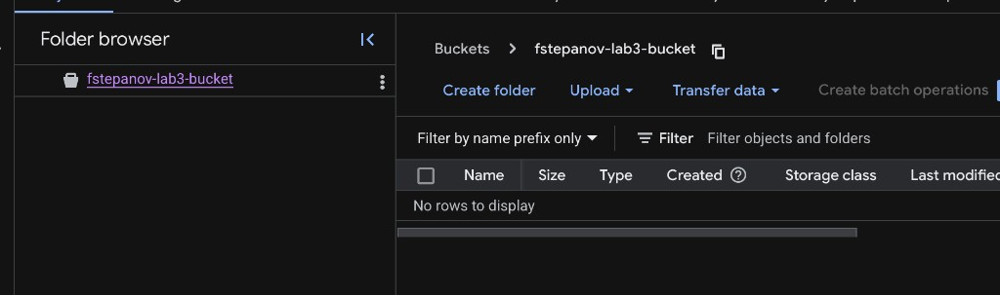

### Работа с файлами и папкой
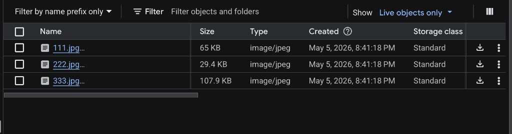
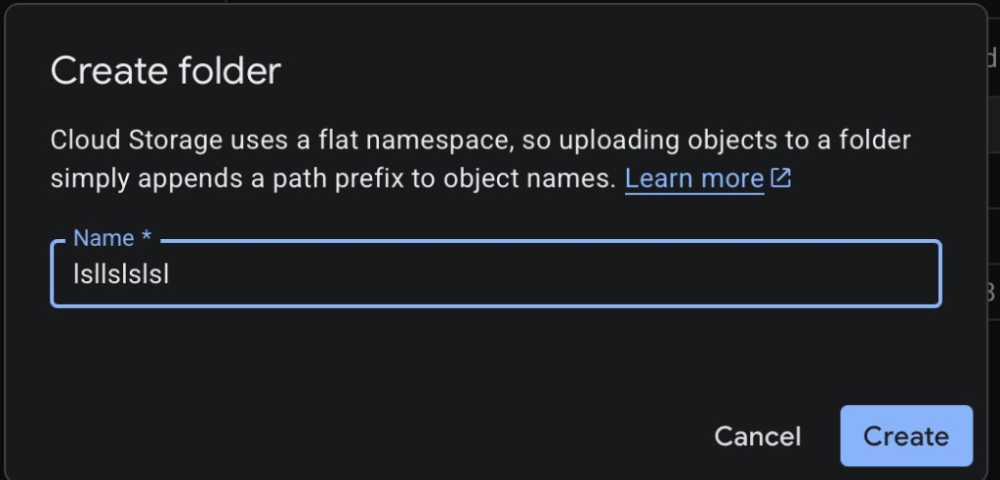
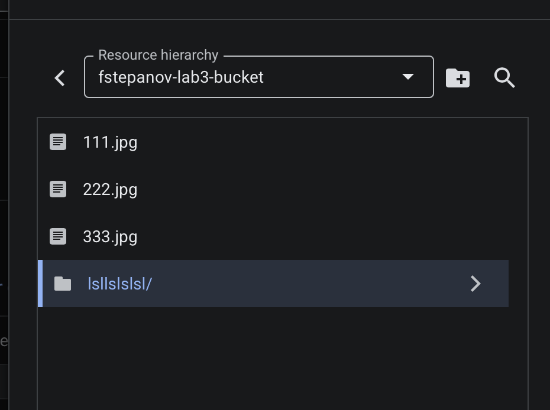
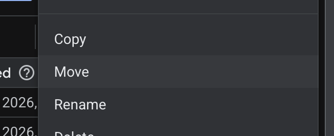
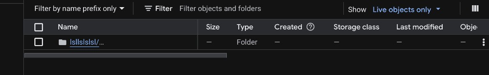
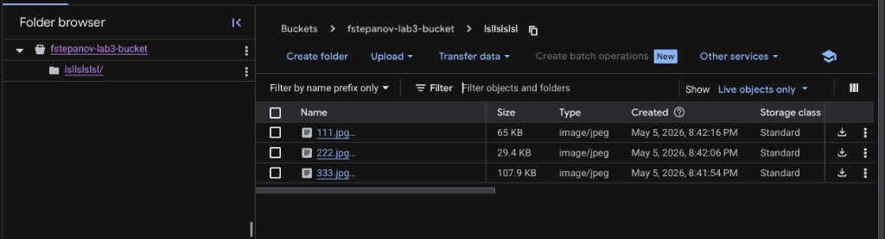
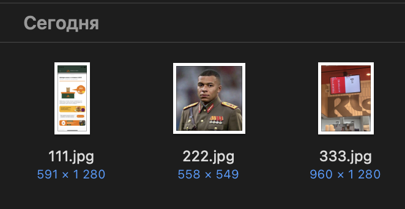

### Публичный доступ

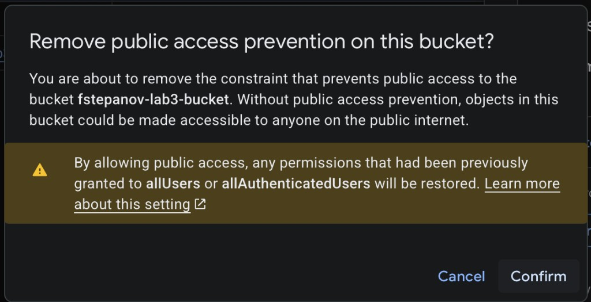
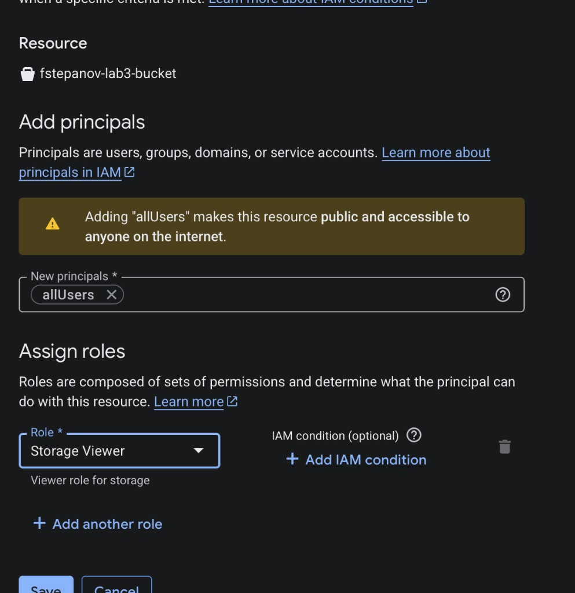

### Удаление ресурсов
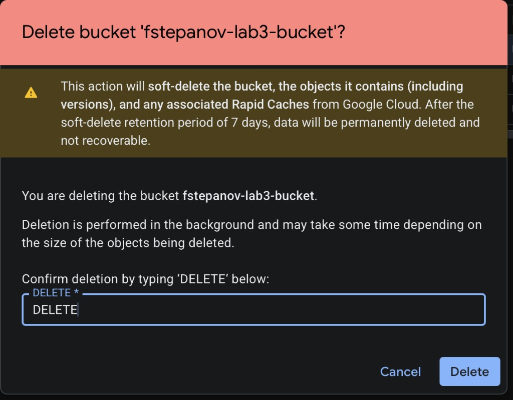

## Выводы
- В Cloud Storage «папки» реализуются через префиксы имен объектов, а не через отдельную файловую иерархию.
- Для публикации контента нужно корректно настроить как ограничение public access prevention, так и IAM-доступ `allUsers`.
- После выполнения лабораторной важно удалять бакет и связанные ресурсы для контроля затрат и безопасности.
