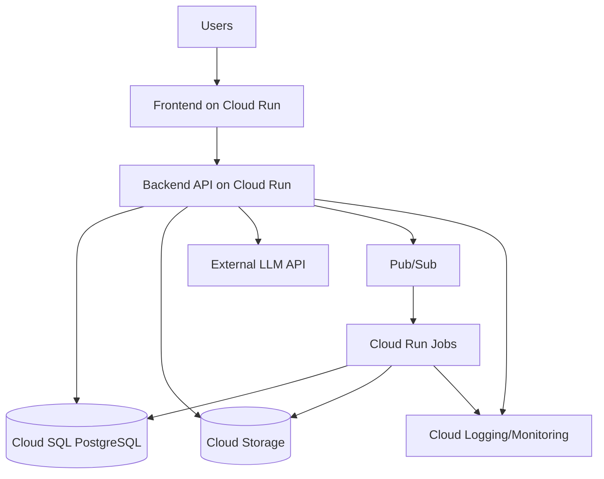

University: [ITMO University](https://itmo.ru/ru/)  
Faculty: [FICT](https://fict.itmo.ru)  
Course: [Cloud platforms as the basis of technology entrepreneurship](https://itmo-ict-faculty.github.io/cloud-platforms-as-the-basis-of-technology-entrepreneurship/)  
Year: 2025/2026  
Group: U4125  
Author: Stepanov Fedor  
Lab: Lab4  
Date of create: 05.05.2026  
Date of finished: 

# Лабораторная работа №4
## Разработка инфраструктуры MVP AI-приложения

## Цель работы
Спроектировать инфраструктуру MVP AI-приложения для трех этапов развития (начало, партнерское тестирование, production), обосновать выбор сервисов и оценить стоимость.

## Постановка
Требуется предложить архитектуру без практического создания ресурсов в облаке:
- начальное состояние (MVP);
- тестирование партнерами;
- production-решение.

## Предлагаемая архитектура
### Компоненты
- Frontend: `Cloud Run` (контейнер с веб-интерфейсом).
- Backend API: `Cloud Run` (REST API + бизнес-логика).
- AI inference: внешний API LLM (pay-as-you-go) на старте, с возможностью перехода на выделенный endpoint.
- База данных: `Cloud SQL (PostgreSQL)`.
- Объектное хранилище: `Cloud Storage` (файлы пользователей/медиа).
- Асинхронные задачи: `Pub/Sub` + `Cloud Run Jobs`.
- Наблюдаемость: `Cloud Logging`, `Cloud Monitoring`, алерты.
- Безопасность: `IAM`, `Secret Manager`, HTTPS, сервисные аккаунты по принципу least privilege.

### Логическая схема
Файл схемы для draw.io: `lab4_infrastructure.drawio`.

## Этапы масштабирования
### 1) Начальный MVP
- 1 сервис `Cloud Run` (frontend+api или 2 минимальных сервиса).
- `Cloud SQL` в минимальном размере.
- Хранение файлов в `Cloud Storage` Standard.
- Основная цель: быстрый запуск и проверка гипотезы.

### 2) Тестирование партнерами
- Разделение frontend/backend на отдельные сервисы.
- Настройка min instances для снижения cold start.
- Подключение очередей (`Pub/Sub`) для тяжелых задач.
- Более детальный мониторинг, SLA-алерты.

### 3) Production
- Разделение окружений: `dev/stage/prod`.
- Высокая доступность БД (HA), резервные копии и политика восстановления.
- Настройка WAF/Cloud Armor (при внешнем трафике).
- FinOps-мониторинг расходов и лимитов.

## Экономическая модель (оценка)
Примерная оценка при умеренной нагрузке (порядок цифр):

| Компонент | MVP / мес | Партнеры / мес | Production / мес |
|---|---:|---:|---:|
| Cloud Run (compute + requests) | $5-20 | $30-80 | $150-500 |
| Cloud SQL PostgreSQL | $20-40 | $60-120 | $200-600 |
| Cloud Storage | $1-10 | $10-30 | $50-200 |
| Pub/Sub + Jobs | $0-5 | $5-20 | $20-80 |
| Observability | $0-10 | $10-40 | $50-200 |
| LLM API | $10-50 | $100-400 | $500-5000+ |
| **Итого (оценка)** | **$36-135** | **$215-690** | **$970-6580+** |

## Обоснование выбора
- `Cloud Run` удобен для MVP и раннего роста: автоскейлинг и оплата за фактическую нагрузку.
- `Cloud SQL` закрывает транзакционные сценарии и дает прогнозируемую структуру данных.
- `Cloud Storage` оптимален для статики и пользовательских файлов.
- Очереди и джобы нужны для устойчивой обработки тяжелых AI-задач, чтобы не блокировать API.

## Риски и меры
- Риск роста стоимости LLM API: вводить лимиты, кэширование, квоты на пользователя.
- Риск деградации при пиковых нагрузках: min instances, backpressure через очереди.
- Риск утечек данных: строгие IAM-роли, Secret Manager, аудит логов доступа.

## Выводы
- Для MVP оптимальна serverless-архитектура с минимальным порогом входа и быстрым масштабированием.
- При переходе к production ключевой фактор — не только стоимость, но и надежность, контроль SLA и безопасность.
- Поэтапная эволюция инфраструктуры снижает технические и финансовые риски при росте продукта.
